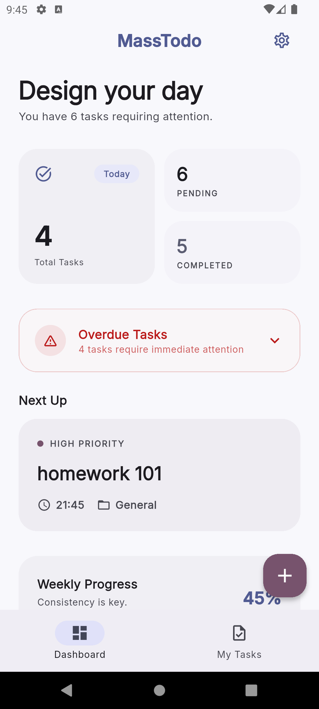
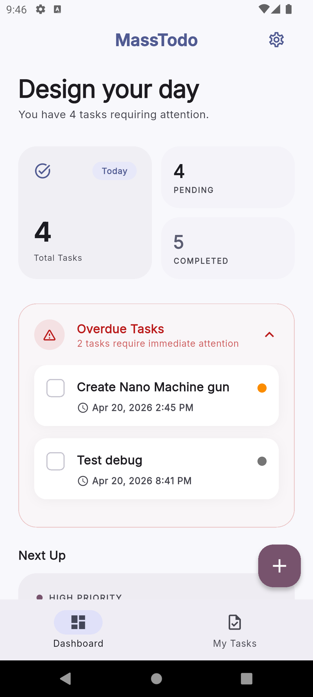
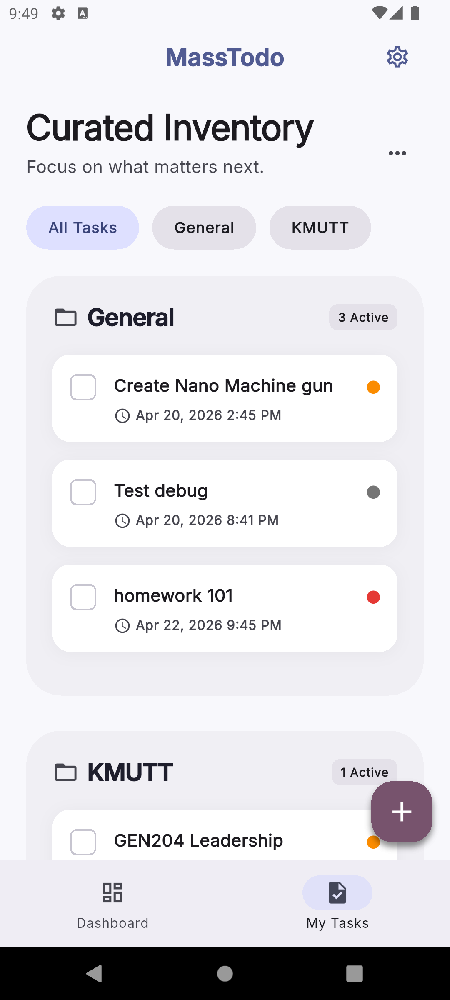
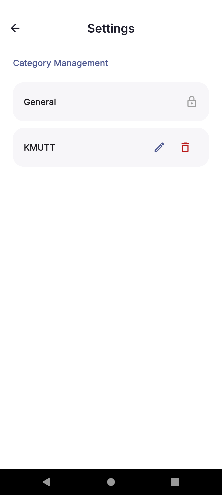

# Mass Todo

## 📋 Overview
Mass Todo is a high-performance, offline-first task management application built with Flutter. It combines a premium design aesthetic (Linear-inspired) with a robust modular architecture to provide a seamless task management experience.

---

## 🚀 Key Features

### 1. Unified Dashboard (The "Architect" Design)
- **Bento Grid Stats**: At-a-glance view of Today's Tasks, Pending Items, and Completed Count.
- **Weekly Progress**: Visual tracking of your consistency throughout the week.
- **Next Up Card**: Dynamic spotlight on your highest priority upcoming task.
- **Overdue Task Section**: Collapsible alert area that surfaces urgent tasks that missed their deadlines.

### 2. Intelligent Task Management
- **Offline-First Persistence**: Powered by SQLite for reliable data storage without an internet connection.
- **Dynamic Categorization**: Group tasks by custom categories (General, Personal, Work, etc.).
- **Smart Filtering**: Toggle visibility of completed tasks and filter the main list by specific categories.

### 3. Category Management
- Dedicated settings interface to manage your organizational hierarchy.

---

## 🏗️ Technical Architecture

| Component | Technology |
| :--- | :--- |
| **Framework** | Flutter 3.41.7 + Dart 3.11.5 |
| **State Management** | Flutter Riverpod 3.x |
| **Database** | Sqflite (SQLite) |
| **UI System** | Material 3 (Standardized surfaceContainerHighest & withValues API) |
| **Fonts** | Google Fonts (Outfit / Inter) |
| **DevOps** | GitHub Actions |

---

### Developer & DevOps Flow
- **Modern State Management**: **Riverpod 3.0** (Notifier & AsyncNotifier patterns).
- **CI/CD Pipeline**:
  - **Automated Check**: Static analysis runs on every pull request.
  - **Controlled Build**: On-demand Android APK generation via GitHub Actions.
  - **Artifact Release**: Verified APK distribution through GitHub Artifacts.

## 📦 Installation & Build
### For Users
Download on github releases

### For Developers
1. Clone the repository.
2. Navigate to `/app`.
3. Run `flutter pub get`.
4. Build release: `flutter build apk --release`.

---

*Generated by Antigravity AI*
